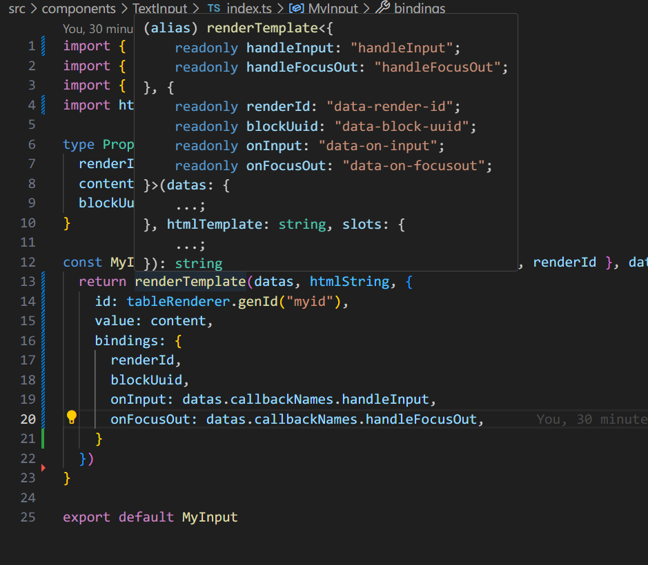

## Logseq data binding experiment - minimal live editing

This is an experiment on data bindings on logseq plugin development. The example is about a minimal live editing.

Mainly based on type inference of typescript.

## Basic ideas

In brief:
- `logseq/handlers.ts`: dom event handlers
- `components`: htmltemplate databinding with type constraint
- `logseq/styles.ts`: one single css style

In detail: 

- register all the data-ref and callback names in `logseq/info.ts`
- bind data-ref and rendering method for this plugin in `components/my-type.ts`
- write components rendering method, and do data binding. see `components/TextInput/index.ts`. event handlers are defined outside in `logseq/handlers.ts`
- render components with html template, where all possible slots are defined in `lib/components.ts` renderTemplate method.
- inject ui into logseq with logseq API ProvideUI in `logseq/render.ts`

Editing live content poses challenges, particularly with auto-blur when updating blocks, hindering continuous editing. Additionally, the editablecontent attribute, sanitized by DOMPurify, limits this functionality to input elements, preventing insertion as flex-width inline elements.

## Why do this

To organize and refactor component in a reliable way.